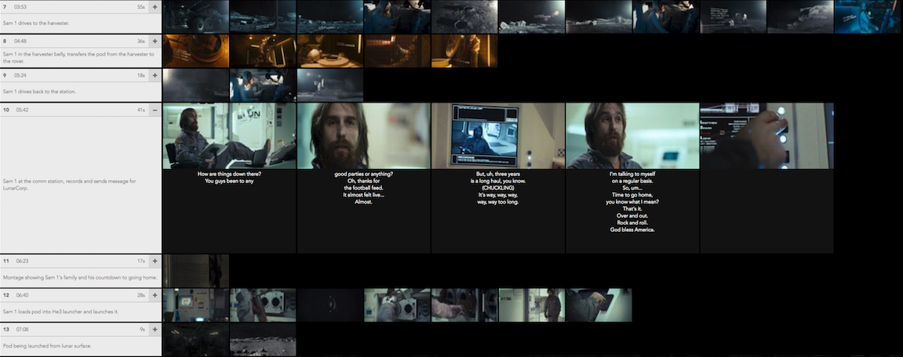

# Movie Map

A scene-by-scene, shot-by-shot visual deconstruction of a film.

 <!-- .element width="100%" -->

This example app screenshot shows the breakdown of the excellent film [_Moon_](https://www.imdb.com/title/tt1182345/) (2009) by Duncan Jones starring Sam Rockwell. This git repo does not contain the actual film data (e.g. shot stills, scene breakdown, etc). It does provide the source code for the web app and example code for processing a film to obtain scene and shot info.

